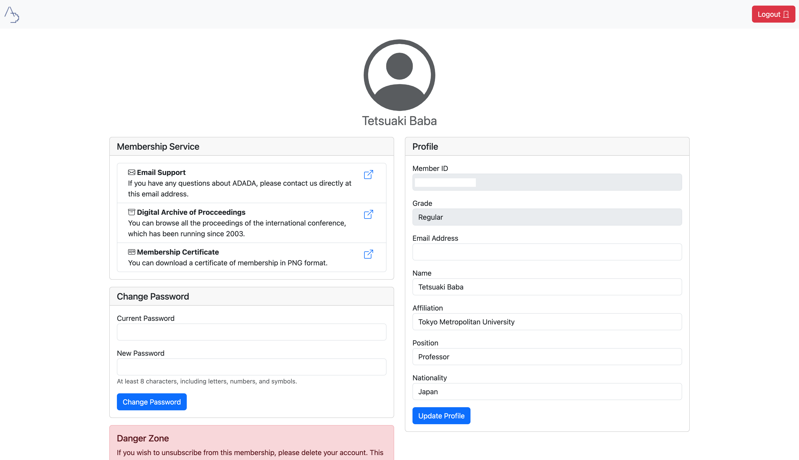

# memberable
ultra simple user management system, especially for small websites, association, conference, etc. This system is originaly designed for a ADADA International Personal Membership management system. 

## Installation
1. Edit Config.php file with your database settings.
2. upload all files to your server, except for this README.md file.
3. open yourdomain.com/initialize_db.php in your browser.
4. delete initialize_db.php file.
5. Login with admin username which is written in Config.php file.
6. Done!

## How to create an acount and login 
1. Access yourdomain.com/register.php to register
2. Access yourdomain.com/login.php to login

## dependencies
  * php 7.0 or higher
  * phpLiteAdmin is included for complex database operations. You can access it on admin's dashboard.php
