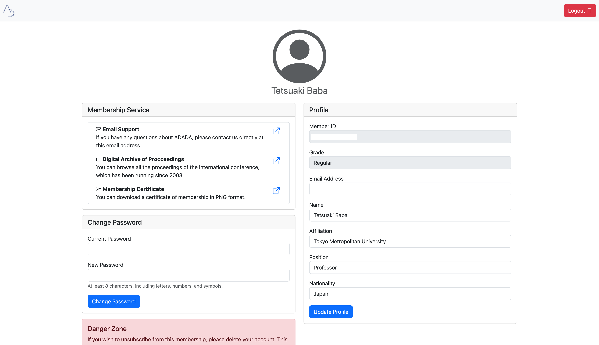

# memberable
ultra simple user management system, especially for small websites, association, conference, etc. This system is originaly designed for a ADADA International Membership management system. 



## Installation
1. Edit config.php file according to your env.
2. Edit mailer/PHPMailer.php file according to your smtp server.
3. upload *.php, mailer/*, images/* and scss/* to your server.
4. open yourdomain.com/initialize_db.php in your browser.
5. delete initialize_db.php file.
6. Login with admin username which is written in config.php file.
7. Done!

## Easy server upload [ memo]
Better to use lftp for uploading files to your server. Here is  a sample upload script.
```
open -u [username],[password] [server address]
set ftp:passive-mode true
cd [to your remote directory for uploading]
mirror --exclude "mailer/sample\.php" --exclude ".gitignore" --exclude "upload\.txt" --exclude ".DS_Store" --exclude ".*\.db" --exclude "node_modules/.*" --exclude ".git/.*"  --exclude "initialize_db\.php" --exclude "config\.php" --exclude "README\.md"  -R  --dry-run ./ ./
ls
bye
```
Once you confirm the files to be uploaded, remove --dry-run option and run the script.

### template of /config.php
```php
<?php
// データベースのパス
define('DB_PATH', 'sample_memberable.db');

// サイトのURL（パスワード再発行のリンクで使用）
define('SITE_URL', 'https://example.com/'); // 実際のドメインに置き換えてください

// メール送信元アドレス
define('MAIL_FROM', 'no-reply@example.com'); // 実際のメールアドレスに置き換えてください

// admin mail address
define('ADMIN_EMAIL', 'admin@example.com'); // 実際のメールアドレスに置き換えてください

// admin initial password
define('ADMIN_PASSWORD', 'engA@8033'); // 管理者の初期パスワード

// header of member_id
define('MEMBER_ID_HEADER', 'adada'); // メンバーIDの先頭に付与する文字列

// title of login.php
define('LOGIN_TITLE', 'Login to myADADA'); // ログインページのタイトル

// header logo image path
define('HEADER_LOGO', 'https://adada.info/cache/images/cached_ef3b881b9775c9e599b094ec32380d7a.png'); // ヘッダーに表示するロゴ画像のパス

// footer of page
define('FOOTER_TEXT', '&copy; 2024 Asia Digital Art and Design Association'); // フッターに表示するテキスト

// agree text
define('AGREE_TEXT', '   I understand that by creating an account, I am joining ADADA Member. The personal information entered herein shall be used solely for the academic development of ADADA and will not be provided to any third party without his/her consent.'); // 利用規約に同意する文言

// 組織名
define('ASSOCIATION_NAME', 'ADADA International'); // 組織名

// membership services
define('MEMBERSHIP_SERVICES', [
    [
        'title' => '<i class="bi bi-envelope"></i> Email Support',
        'description' => 'If you have any questions about ADADA, please contact us directly at this email address.',
        'link' => 'mailto:office@adada.info?subject=Inquiry',
    ],    
    [
        'title' => '<i class="bi bi-postcard"></i> Membership Certificate',
        'description' => 'You can download a certificate of membership in PNG format.',
        'link' => 'certificate.php',
    ],
]); // メンバーシップサービス（自由に増やすことができます）
?>
```
### template of /mailer/config.php
```php
<?php
// SMTP設定
$SMTP_SERVER = ''; // SMTPサーバーのアドレス
$SMTP_USERNAME = ''; // SMTPサーバーのユーザー名
$SMTP_SENDER_ADDRESS = ''; // 送信者のメールアドレス
$SMTP_PASSWORD = ''; // SMTPサーバーのパスワード
$SMTP_PORT = 465; // SMTPポート（TLSなら587, SSLなら465）
?>
```

## How to create an acount and login 
1. Access yourdomain.com/register.php to register
2. Access yourdomain.com/login.php to login

## dependencies
  * php 7.0 or higher
  * phpLiteAdmin is included for complex database operations. You can access it on admin's dashboard.php
